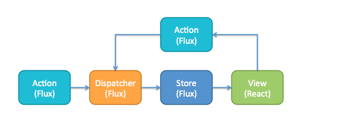
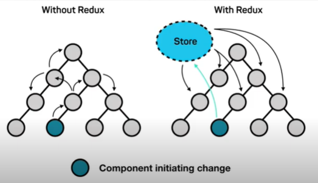
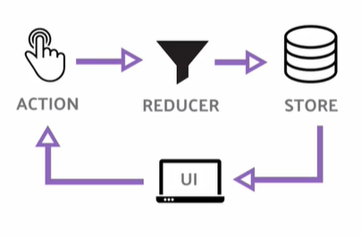

# Redux

Flux: https://carlosazaustre.es/como-funciona-flux

> **Arquitectura Flux**: Es aquella que soluciona los problemas del patrón MVC que tenía flujo de datos bidireccional y lo reemplaza por una arquitectura unidereccional donde la vista genera una acción y esta acción a su vez provoca un reducer que a su vez actualiza el estado general y finalmente se actualiza la vista. Todo es un paso unidireccional de datos



Redux es una librería escrita en JavaScript, basada en la **arquitectura Flux**, creada con Facebook y creada por Dan Abramov, se basa en 3 principios fundamentales:

1. **Única fuente de la verdad:**
   Nuestra aplicación solo debe de tener un único Store y es la única fuente de información.

2. **El estado es de solo lectura**
   La única forma de modificar el estado es emitiendo un acción, este objeto describe lo que va a ocurrir.

3. **Los cambios se realizan con funciones puras**
   Para realizar cambios al estado es necesario utilizar Reducers los cuales son funciones puras que toman el estado anterior, una acción y devuelve un nuevo estado con las modificaciones necesarias.

Nuestra UI va a activar una action, esta action va a ejecutar un reducer para modificar la información del store, y al actualizarse el store la UI se va a modificar.

Redux propone una forma de manejar el estado donde podamos controlar cómo vamos a interactuar con otros elementos (llamadas a un API) o interacciones dentro de nuestra aplicación, Redux hace intento de predecir las mutaciones que pueda sufrir el estado, creando restricciones de `cuando y como` pueden ser ejecutadas las actualizaciones en nuestras aplicaciones.





## Instalación de Redux

Para instalar en nuestro proyecto:

```bash
npm install redux react-redux --save
```

- **redux** => Trae todos los elementos necesarios de la librería de `Redux`
- **react-redux** => Nos permité implementar `redux` de una manera más fácil

## Implementación de Redux en React

1. En la carpeta `src` del proyecto debemos crear dos carpetas:

   1. `actions`
   2. `reducers`

Dentro de cada una, debemos crear un archivo `index.js`

2. En el archivo `index.js` de la raíz de la carpeta `src` vamos a hacer 2 importes:

```js
import { Provider } from 'react-redux';
```

- Nos da un provider que nos va a permitir `encapsular` nuestros componentes a través de un `conect` que va a tener toda la información del `store ` transmitida a estos componentes. De esta forma vamos a poder extraer el estado que tengamos en toda la App, y así tener en cada componente la info que necesita

```js
import { createStore } from 'redux';
```

- Nos va a ayudar a crear el `store` y compartir a toda la App

3. Inicializamos la aplicación con el `Provider` que importamos anteriormente:

```js
// /src/index.jsx
import React from 'react';
import ReactDOM from 'react-dom';
import App from './routes/App';
import { Provider } from 'react-redux';
import { createStore } from 'redux';

ReactDOM.render(
  <Provider>
    <App />
  </Provider>,
  document.getElementById('app')
);
```

## Creación de la Store para manejar el estado
